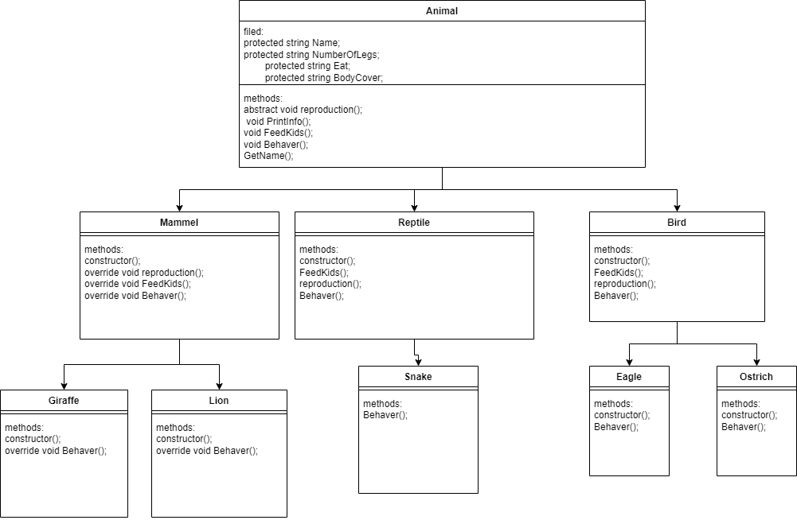

# Lab-6
## Zoo animals
this project will add some animals to your zoo depend in some categories as shown in diagram below.

animal is the base abstract class has three abstract method (parent)
Mammel and Reptile and Bird are abstract classes that inherite from animal abstract class ahve some abstract methods and virtual methods.(parent and derived)
Eagle and Ostrich  Giraffe and Lion and snake classes inherite from Bird class and override some methods(polymorphism ). derived
Giraffe and Lion classes inherite from Mammel class and override some methods(polymorphism ). derived
Snake class inherite from Reptile class. derived
